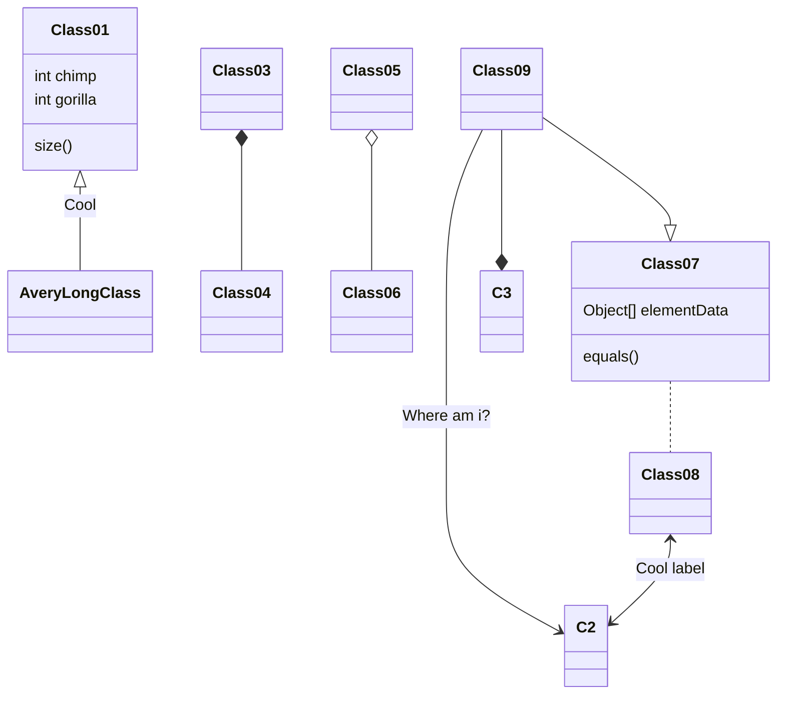

# sauvegarde-japon.sobieski.name

## Source des kanjis

http://kanji.free.fr/index.php

## Test

https://mermaidjs.github.io/mermaid-live-editor/#/view/Y2xhc3NEaWFncmFtCkZpbGVzVG9QeXRob24gLS0-IENzdlRvTGlzdCA6IExpc3RlIGRlIGZpY2hpZXJzCkZpbGVzVG9QeXRob24gOiBMaXN0ZURlRmljaGllcnMoY2hlbWluKQpGaWxlc1RvUHl0aG9uIDogc3RyIHBhdGgKRmlsZXNUb1B5dGhvbiA6IExpc3RlRGVGaWNoaWVycyhjaGVtaW4pCkNzdlRvTGlzdCA6IGNvbnZlcnRpc3NldXIoZmljaGllcikKQ3N2VG9MaXN0IC0tPiBGaWxlc1RvUHl0aG9uIDogTGlzdGUgZGUgZmljaGllcnM
